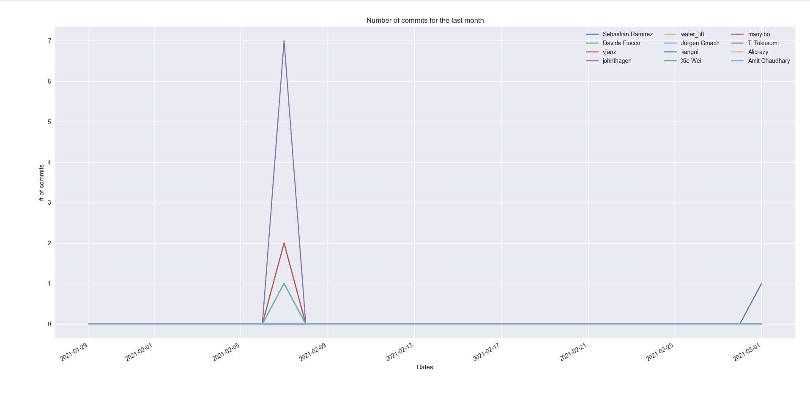
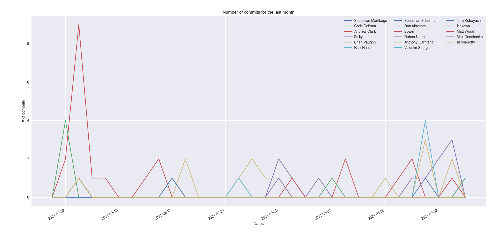

# githubtask

Test task via PyGithub and Matplotlib(PyQt5 for GUI)

Please activate venv and install all requirements before running `main.py`. Fastapi repo is cloned first, then we start
working on it. I hope for test-task purposes this is enough

**FastAPI**

**ReactJS**

