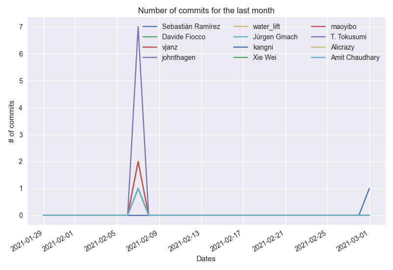
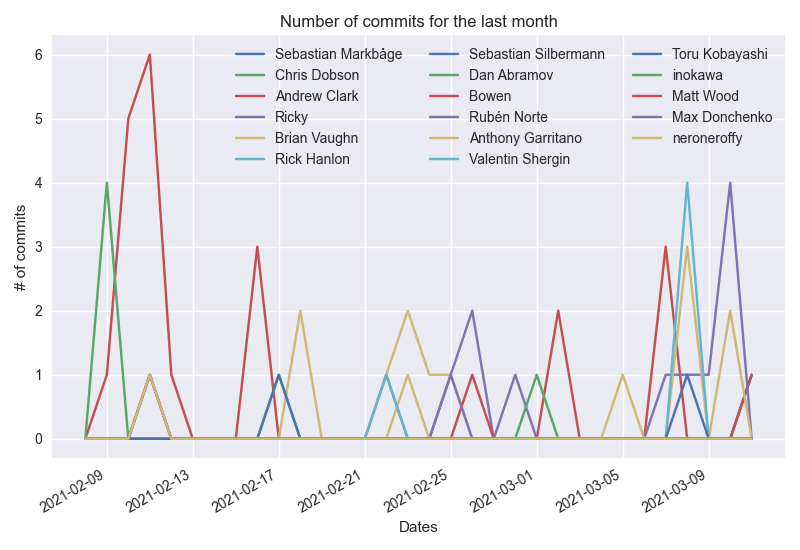

# githubtask

Test task with PyGithub and Matplotlib(PyQt5 for GUI)

Please activate venv and install all requirements before running `main.py`. I kept gihtub personal access token in
main.py instead of using .env I hope for test-task purposes this is enough

**FastAPI**

**ReactJS**

